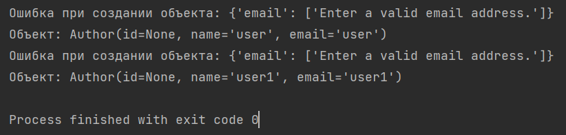

## Примеры работы с БД Django

### Структура:

* `fields_and_types.md` - Обзор типов полей и передаваемых параметров в поле.
* `commands_db.py` - Примеры команд для решения конкретных задач.
* `*.json` - Файлы json с данными для первичного заполения БД.
* `convert_data_to_json.py` - Python скрипт для конвертирования первичных данных в
json.
* `fill_data_in_db.py` - Python скрипт для записи первичных данных в
БД.
* 

### Алгоритм подготовки БД к выполнению запросов из репозитория:
1. В консоле переходим в папку `projectDbDjango`, чтобы рабочая
директория была `.../practiceWebDb/projectDbDjango`
в общем случаем можно воспользоваться командой в консоле
    `cd projectDbDjango`
2. Создаём миграции
    `python manage.py makemigrations`
3. Создаём таблицы в БД
    `python manage.py migrate`
4. Создаём администратора (пунк необязателен, если **не хотите** заходить в панель администратора)
    `python manage.py createsuperuser`
Помните, что пароль при создании администратора вообще никак не отображается
5. Запускаем python скрипт (заполняет БД данными для выполнения запросов) 
`fill_data_in_db.py` (если в консоль вышли предупреждения, но закончилось кодом 0 - 
Process finished with exit code 0, то значит все создалось. Ошибки запланированы по коду)

### Чтобы попасть в панель администратора необходимо:
1. Запустить сервер (если он не запущен)
`python manage.py runserver`
2. Перейти по предложенному адресу и в адресной строке добавить `admin/`.
Или зайти по ссылке http://127.0.0.1:8000/admin/
3. Зайти под администратором с логином и паролем, который указывали при создании 
администратора

