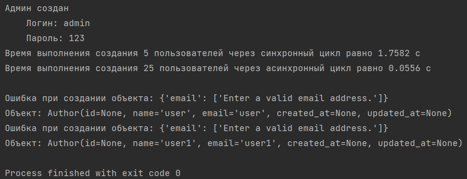

## Примеры работы с БД Django

Устанавливаем зависимости командой 
```pip install -r requirements.txt```

### Структура:

* `examples/fields_and_types.md` - Обзор типов полей и передаваемых параметров в поле.
* `examples/queryes.md` - Обзор на составление запросов при получении данных.
* `examples/queryes_update_delete.md` - Обзор на составление запросов при обновлении/удалении данных.
* `commands.py` - Файл для поверки запросов.
* `data/*.json` - Файлы json с данными для первичного заполнения БД.
* `convert_data_to_json.py` - Python скрипт для конвертирования первичных данных в
json.
* `fill_data_in_db.py` - Python скрипт для записи первичных данных в БД.
* 

### Алгоритм подготовки БД к выполнению запросов из репозитория:
1. Создаём миграции
    `python manage.py makemigrations`
2. Создаём таблицы в БД
    `python manage.py migrate`
3. Создаём администратора (пунк необязателен, если **не хотите** заходить в панель администратора)
    `python manage.py createsuperuser`
Помните, что пароль при создании администратора вообще никак не отображается
4. Запускаем python скрипт (заполняет БД данными для выполнения запросов) 
`fill_data_in_db.py` (если в консоль вышли предупреждения, но закончилось кодом 0 - 
Process finished with exit code 0, то значит все создалось. Ошибки запланированы по коду)


### Чтобы попасть в панель администратора необходимо:
1. Запустить сервер (если он не запущен)
`python manage.py runserver`
2. Перейти по предложенному адресу и в адресной строке добавить `admin/`.
Или зайти по ссылке http://127.0.0.1:8000/admin/
3. Зайти под администратором с логином и паролем, который указывали при создании 
администратора

